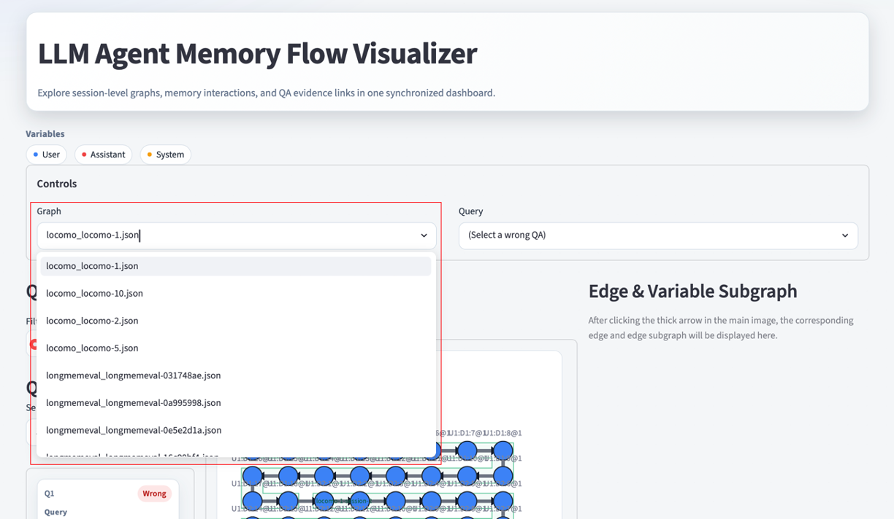
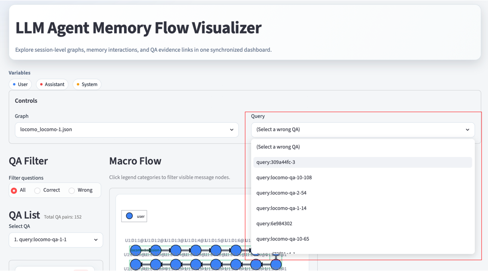
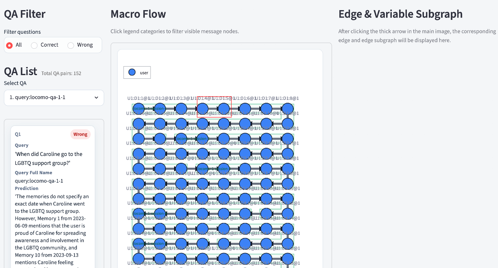
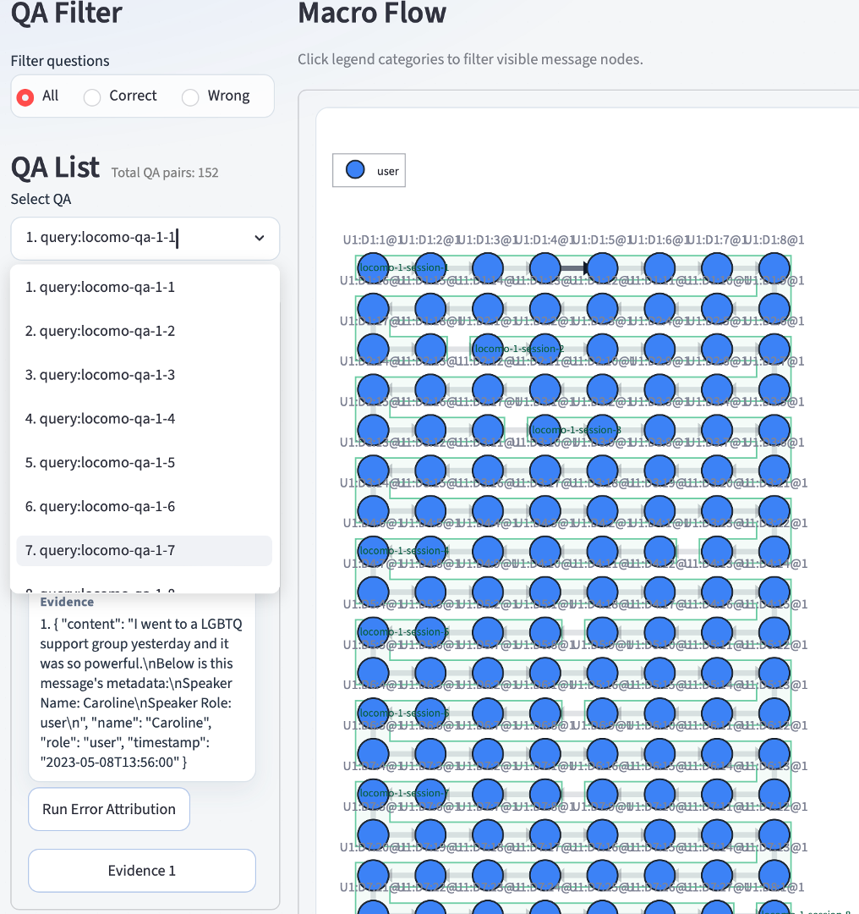
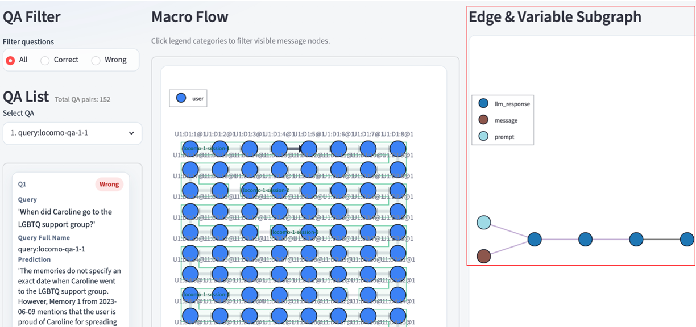
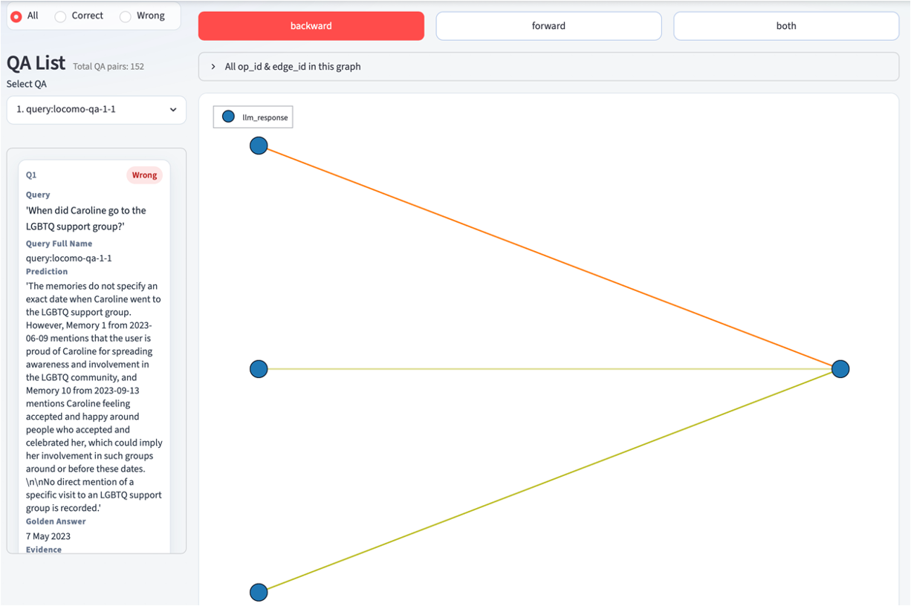
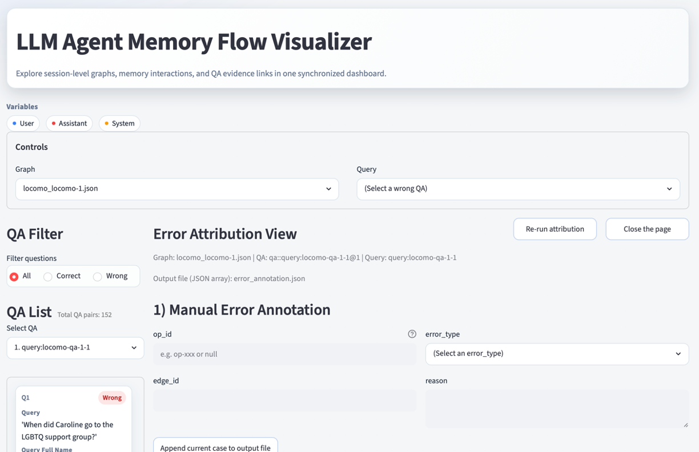

# Annotation Interface

This annotation interface is a Streamlit-based visualization frontend for inspecting execution graphs of memory-augmented LLM agents. It helps users trace message flow, inspect variable-level subgraphs, browse local dependency neighborhoods, and analyze failed question-answering (QA) cases with trace-based error attribution.

---

## Table of Contents

- [Overview](#overview)
- [Features](#features)
- [Installation](#installation)
- [Running the Web App](#running-the-web-app)
- [Project Structure](#project-structure)
- [View Interaction](#view-interaction)
- [Error Attribution Output](#error-attribution-output)

---

## Overview

This annotation interface is designed for interactive inspection of trace graphs exported in the `smartcomment` style.

The current UI supports:

- graph-level browsing across multiple JSON files
- global wrong-QA navigation
- macro message-flow visualization
- edge-triggered construction subgraph inspection
- node-triggered related-variable BFS exploration
- trace-based error attribution for failed QA cases

---

## Features

### 1. Graph Selector

At the top of the page, users can switch between different graphs discovered from a single JSON file or a dataset directory.



### 2. Global Wrong-QA Selector

The `Query` selector jumps directly to the graph containing the selected wrong QA and synchronizes the left sidebar selection.



### 3. Macro Flow Timeline

The central timeline shows message-level flow in a boustrophedon layout.
Clicking a thick edge opens the corresponding runtime construction subgraph on the right.



### 4. QA Sidebar

The left sidebar supports:

- QA filtering: `all / correct / wrong`
- selecting a specific QA item
- opening error attribution for failed cases
- jumping to evidence nodes



### 5. Edge & Variable Subgraph

The right-side detail panel renders the runtime construction subgraph of the currently selected macro edge.



### 6. Related Variable View

Clicking a node inside the subgraph opens a 1-hop BFS view for the selected runtime variable.



### 7. Error Attribution View

For wrong QA items, the app can run trace-based error attribution and render:

- construction subgraphs by evidence
- retrieval subgraph
- response subgraph
- manual annotation form for exporting attribution labels



---

## Installation

We recommend using **Python 3.12**.

Install dependencies with:

```bash
conda create -n memtrace-web python=3.12 -y
conda activate memtrace-web

pip install -r requirements.txt
```

---

## Running the Web App

```bash
streamlit run app.py -- \
  --data /path/to/graph_or_dataset \
  --api-config ../input_files/api_config.json \
  --output-path error_annotation.json \
  --judge-model gpt-4.1-mini
```

The `--data` argument can point to either a single execution graph file or a directory containing many execution graph files. An execution graph file is a JSON file exported by [smartcomment](https://github.com/zjunlp/smartcomment). You can organize graph files into directories, for example by the memory system that produces them, and then pass the directory path to `--data`. To generate execution graph data from memory systems, see the MemBase tracing [tutorial](https://github.com/zjunlp/MemBase/tree/main/examples/trace_memory_lifecycle_with_membase). The `--api-config` argument can point to the API config file under `input_files`, such as `../input_files/api_config.json`. The `--judge-model` argument specifies the base model used by the assistant annotation algorithm.

---

## Project Structure

```text
annotation_interface/
├── app.py
├── config.py
├── components/
│   ├── timeline_plotter.py
│   ├── sidebar_widgets.py
│   ├── op_detail_view.py
│   ├── variable_relation_view.py
│   └── error_attribution_view.py
├── data_engine/
│   ├── parser.py
│   ├── loader.py
│   ├── dataset_index.py
│   └── qa_linkage.py
├── utils/
│   ├── geometry.py
│   ├── graph_render.py
│   ├── runtime_graph.py
│   └── session_state.py
└── error_attribution/
    ├── trace_error_attribution.py
    └── inference_utils/
```

### `app.py`

- Streamlit entrypoint
- command line argument parsing
- top-level graph / query controls
- multi-view routing

### `components/`

Contains UI rendering logic for each major page region:

- timeline
- sidebar
- edge detail view
- related-variable BFS view
- error attribution view

### `data_engine/`

Contains data ingestion and parsing logic:

- dataset scanning and lightweight indexing
- file-level graph loading
- JSON-to-`GraphRecord` parsing
- QA linkage extraction

### `utils/`

Contains shared helpers for:

- session state
- runtime graph loading
- plotting utilities
- geometry utilities

### `error_attribution/`

Contains the trace-based attribution pipeline and inference utilities.

---

## View Interaction

### Macro Flow → Subgraph

Clicking a timeline edge in `Macro Flow` opens the corresponding runtime construction subgraph.

### Subgraph / Attribution Graph → Related Variable View

Clicking a node inside the edge-detail subgraph or attribution graph opens the related-variable BFS view.

### Query Selector → Graph + Sidebar QA

Selecting a wrong QA from the top `Query` dropdown:

- jumps to the target graph
- switches the sidebar to the wrong-QA filter
- auto-selects the matching QA item

### Manual Graph Switch

Manually switching the `Graph` selector clears the top query selection so that an old query does not immediately pull the app back to the previous graph.

---

## Error Attribution Output

When `Append current case to output file` is clicked in the error attribution view, the current manual annotation is appended to `--output-path`.

The saved format is:

```json
[
  {
    "saved_at": "...",
    "graph_id": "...",
    "query_id": "...",
    "query": "...",
    "manual_error_attribution": {
      "op_id": "...",
      "error_type": "...",
      "edge_id": "...",
      "reason": "..."
    }
  }
]
```

---
